# 🎓 EduSponsor - Education Sponsorship Platform


[](https://nextjs.org/)
[](https://www.typescriptlang.org/)
[](https://tailwindcss.com/)
[](https://prettier.io/)
[](https://coderabbit.ai/)
[](https://orm.drizzle.team/)


---


## 🌟 Overview


**EduSponsor** is a comprehensive education sponsorship platform that connects generous sponsors with students in need of educational support. Our platform facilitates meaningful relationships between donors and educational institutions while providing transparent tracking of contributions and student progress.


### ✨ Key Features


- 🏫 **School Management** - Complete school directory and administration
- 👨‍🎓 **Student Profiles** - Detailed student information and progress tracking 
- 💝 **Sponsorship Matching** - Connect sponsors with students seamlessly
- 💰 **Donation Processing** - Secure payment integration with Stripe
- 📊 **Analytics Dashboard** - Real-time insights and reporting
- 🔐 **Role-Based Access** - Secure authentication with role management
- 📱 **Responsive Design** - Beautiful UI that works on all devices
- ⚡ **Real-time Updates** - Live data synchronization


---


## 🏗️ System Architecture

```mermaid
graph TB
   %% User Layer
   subgraph "👥 User Layer"
       U1[["💝 Sponsors<br/>(Donors)"]]
       U2[["🎓 Students<br/>(Recipients)"]]
       U3[["🏫 Schools<br/>(Administrators)"]]
   end


   %% Frontend Layer
   subgraph "🎨 Frontend - Next.js 15 Application"
       subgraph "🌐 Public Pages"
           LP["🏠 Landing Page<br/>Features, Testimonials, FAQ"]
           AUTH["🔐 Auth Pages<br/>Login & Register"]
       end
      
       subgraph "🔒 Protected Dashboard"
           DASH["📊 Dashboard<br/>Role-based Analytics"]
           SPONSOR["💝 Sponsorship<br/>Management"]
           DONATE["💰 Donations<br/>Tracking & Processing"]
           STUDENTS["👨‍🎓 Students<br/>Profiles & Search"]
           SCHOOLS["🏫 Schools<br/>Directory & Management"]
           PROFILE["⚙️ Profile<br/>Settings"]
       end
      
       subgraph "🎨 UI Components"
           UI["🎯 Shadcn/UI Components<br/>Modern, Accessible Design"]
           CHARTS["📈 Recharts<br/>Data Visualization"]
           ANIM["✨ Framer Motion<br/>Smooth Animations"]
       end
   end


   %% Middleware & Security
   subgraph "🛡️ Security & Routing"
       MW["🚪 Next.js Middleware<br/>Route Protection"]
       AUTH_GUARD["🔐 Auth Guard<br/>JWT Token Validation"]
       ROLE_GUARD["👮 Role Guard<br/>Permission Control"]
   end


   %% State Management
   subgraph "🗄️ State Management"
       TQ["🔄 TanStack Query<br/>Server State Caching"]
       CTX["🗃️ Context Providers<br/>Global State Management"]
       HOOKS["🪝 Custom Hooks<br/>Reusable Logic"]
   end


   %% Services Layer
   subgraph "⚙️ Services Layer"
       API_CLIENT["📡 Axios Client<br/>HTTP Interceptors"]
       AUTH_SVC["🔑 Auth Service<br/>Login, Register, JWT"]
       PAYMENT_SVC["💳 Payment Service<br/>Stripe Integration"]
       STUDENT_SVC["👨‍🎓 Student Service<br/>CRUD Operations"]
       SCHOOL_SVC["🏫 School Service<br/>Management"]
   end


   %% Database Layer
   subgraph "🗃️ Database Layer"
       NEON["🐘 Neon PostgreSQL<br/>Serverless Database"]
       DRIZZLE["🔧 Drizzle ORM<br/>Type-safe Queries"]
   end


   %% External Services
   subgraph "🌐 External Services"
       STRIPE["💳 Stripe<br/>Payment Processing"]
       EMAIL["📧 Email Service<br/>Notifications"]
       STORAGE["☁️ File Storage<br/>Images & Documents"]
   end


   %% Connections
   U1 --> LP
   U2 --> LP
   U3 --> LP
  
   LP --> AUTH
   AUTH --> DASH
  
   DASH --> SPONSOR
   DASH --> DONATE
   DASH --> STUDENTS
   DASH --> SCHOOLS
   DASH --> PROFILE
  
   UI --> DASH
   CHARTS --> DASH
   ANIM --> DASH
  
   MW --> AUTH_GUARD
   AUTH_GUARD --> ROLE_GUARD
  
   TQ --> CTX
   CTX --> HOOKS
  
   HOOKS --> API_CLIENT
   API_CLIENT --> AUTH_SVC
   API_CLIENT --> PAYMENT_SVC
   API_CLIENT --> STUDENT_SVC
   API_CLIENT --> SCHOOL_SVC
  
   AUTH_SVC --> NEON
   PAYMENT_SVC --> STRIPE
   STUDENT_SVC --> DRIZZLE
   SCHOOL_SVC --> DRIZZLE
   DRIZZLE --> NEON
  
   PAYMENT_SVC --> EMAIL
   AUTH_SVC --> EMAIL
```





### 🔧 Technology Stack


| Category | Technologies |
|----------|-------------|
| **Frontend** | Next.js 15, React 19, TypeScript |
| **Styling** | Tailwind CSS 4, Shadcn/UI, Framer Motion |
| **State Management** | TanStack Query, React Context |
| **Database** | Neon PostgreSQL, Drizzle ORM |
| **Authentication** | JWT, Cookies, Role-based Access |
| **Payments** | Stripe Integration |
| **Development** | ESLint, Prettier, CodeRabbit AI |
| **Testing** | Vitest, Testing Library |


---


## 🚀 Getting Started


### 📋 Prerequisites


Before you begin, ensure you have the following installed:


- **Node.js** (v18.0.0 or higher)
- **npm** or **yarn** package manager
- **Git** for version control


### ⚡ Quick Start


1. **Clone the Repository**
  ```bash
  git clone https://github.com/your-username/edu-sponsor.git
  cd edu-sponsor
  ```


2. **Install Dependencies**
  ```bash
  npm install
  # or
  yarn install
  ```


3. **Environment Setup**
 
  Create a `.env.local` file in the root directory:
  ```env
  # Database
  DATABASE_URL="your-neon-postgresql-url"
 
  # Authentication
  JWT_SECRET="your-super-secret-jwt-key"
 
  # API
  NEXT_PUBLIC_API_URL="https://your-api-url.com"
 
  # Stripe (for payments)
  STRIPE_SECRET_KEY="sk_test_..."
  NEXT_PUBLIC_STRIPE_PUBLISHABLE_KEY="pk_test_..."
 
  # Email Service
  EMAIL_SERVICE_API_KEY="your-email-service-key"
  ```


4. **Database Setup**
  ```bash
  # Generate database schema
  npm run db:generate
 
  # Push schema to database
  npm run db:push
 
  # Optional: Open database studio
  npm run db:studio
  ```


5. **Start Development Server**
  ```bash
  npm run dev
  ```


  🎉 Open [http://localhost:3000](http://localhost:3000) in your browser!


---


## 📦 Available Scripts


| Command | Description |
|---------|-------------|
| `npm run dev` | Start development server with Turbopack |
| `npm run build` | Build for production |
| `npm run start` | Start production server |
| `npm run lint` | Run ESLint checks |
| `npm run format` | Format code with Prettier |
| `npm run test` | Run tests with Vitest |
| `npm run test:watch` | Run tests in watch mode |
| `npm run test:coverage` | Generate test coverage report |
| `npm run db:push` | Push schema to database |
| `npm run db:studio` | Open Drizzle Studio |
| `npm run db:generate` | Generate database migrations |


---


## 🏢 Project Structure


```
edu-sponsor/
├── 📁 src/
│   ├── 📁 app/                    # Next.js App Router
│   │   ├── 📁 dashboard/          # Protected dashboard pages
│   │   ├── 📁 login/              # Authentication pages
│   │   └── 📄 layout.tsx          # Root layout
│   ├── 📁 components/             # Reusable components
│   │   ├── 📁 ui/                 # Shadcn/UI components
│   │   ├── 📁 forms/              # Form components
│   │   └── 📁 dashboard/          # Dashboard-specific components
│   ├── 📁 hooks/                  # Custom React hooks
│   ├── 📁 lib/                    # Utility functions
│   ├── 📁 providers/              # Context providers
│   ├── 📁 services/               # API services
│   └── 📄 middleware.ts           # Next.js middleware
├── 📁 public/                     # Static assets
├── 📄 tailwind.config.js          # Tailwind configuration
├── 📄 next.config.ts              # Next.js configuration
├── 📄 drizzle.config.ts           # Database configuration
└── 📄 package.json                # Dependencies and scripts
```


---


## 🔐 Authentication & Roles


The platform supports role-based access control with three main user types:


### 👥 User Roles


| Role | Permissions | Dashboard Access |
|------|-------------|------------------|
| **🏫 School** | Manage students, view donations | Dashboard, Students, Donations, Settings |
| **💝 Sponsor** | View students, make donations | Dashboard, Schools, Sponsorships, Settings |
| **👨‍💼 Admin** | Full system access | All features and management tools |


### 🛡️ Security Features


- **JWT Authentication** with secure cookie storage
- **Role-based Route Protection** via middleware
- **API Request Interceptors** for automatic token refresh
- **CSRF Protection** and secure headers
- **Input Validation** and sanitization


---


## 💳 Payment Integration


EduSponsor integrates with **Stripe** for secure payment processing:


- **Secure Checkout** sessions
- **Multiple Payment Methods** (Cards, Digital Wallets)
- **Donation Tracking** with real-time updates
- **Receipt Generation** and email notifications
- **Subscription Management** for recurring donations


---


## 🧪 Testing


We maintain high code quality with comprehensive testing:


```bash
# Run all tests
npm run test


# Run tests in watch mode
npm run test:watch


# Generate coverage report
npm run test:coverage
```


### 📊 Test Coverage Goals
- **Unit Tests**: Component logic and utilities
- **Integration Tests**: API endpoints and user flows
- **E2E Tests**: Critical user journeys


---


## 🎨 UI/UX Design System


Built with modern design principles:


- **🎯 Shadcn/UI**: Accessible, customizable components
- **🎨 Tailwind CSS**: Utility-first styling approach
- **✨ Framer Motion**: Smooth animations and transitions
- **📱 Responsive Design**: Mobile-first approach
- **♿ Accessibility**: WCAG 2.1 AA compliance
- **🌙 Dark Mode**: Coming soon!


---


## 🚀 Deployment


### Production Deployment


1. **Build the Application**
  ```bash
  npm run build
  ```


2. **Environment Variables**
 
  Ensure all production environment variables are set in your hosting platform.


3. **Deploy to Vercel** (Recommended)
  ```bash
  vercel --prod
  ```


### 🔍 Performance Optimization


- **Next.js App Router**: Optimal loading and caching
- **Image Optimization**: Automatic WebP conversion
- **Code Splitting**: Lazy loading for better performance
- **CDN Integration**: Fast global content delivery


---


## 👥 Contributors


We're proud to have an amazing team working on EduSponsor:


<table>
 <tr>
   <td align="center">
     <sub><b>Mukunzi Ndahiro James</b></sub><br />
     <small>🚀 Tech Lead</small>
   </td>
   <td align="center">
     <sub><b>Uwase Sonia</b></sub><br />
     <small>🔍 Quality Assurance</small>
   </td>
   <td align="center">
     <sub><b>Bianca Haguma</b></sub><br />
     <small>🔍 Quality Assurance</small>
   </td>
 </tr>
 <tr>
   <td align="center">
     <sub><b>Alice Uwase</b></sub><br />
     <small>💻 Developer</small>
   </td>
   <td align="center">
     <sub><b>Igor Noel</b></sub><br />
     <small>💻 Developer</small>
   </td>
   <td align="center">
     <sub><b>Higiro Loic</b></sub><br />
     <small>💻 Developer</small>
   </td>
 </tr>
</table>


### 🤝 Contributing


We welcome contributions! Here's how you can help:


1. **Fork the Repository**
2. **Create a Feature Branch**
  ```bash
  git checkout -b feature/amazing-feature
  ```
3. **Commit Your Changes**
  ```bash
  git commit -m 'Add some amazing feature'
  ```
4. **Push to Branch**
  ```bash
  git push origin feature/amazing-feature
  ```
5. **Open a Pull Request**


### 📋 Contribution Guidelines


- Follow the existing code style
- Write tests for new features
- Update documentation as needed
- Use conventional commit messages
- Ensure all tests pass


---


## 📄 License


This project is licensed under the **MIT License** - see the [LICENSE](LICENSE) file for details.


---


## 🆘 Support


Need help? We're here for you:


- 📧 **Email**: support@edusponsor.com
- 💬 **Discord**: [Join our community](https://discord.gg/edusponsor)
- 📖 **Documentation**: [Full documentation](https://docs.edusponsor.com)
- 🐛 **Issues**: [Report bugs](https://github.com/your-username/edu-sponsor/issues)


---


## 🔮 Roadmap


### 🚧 Coming Soon


- [ ] 🌙 Dark mode support
- [ ] 📱 Mobile app (React Native)
- [ ] 🔔 Real-time notifications
- [ ] 📊 Advanced analytics dashboard
- [ ] 🌍 Multi-language support
- [ ] 🤖 AI-powered matching system
- [ ] 📈 Impact tracking and reporting
- [ ] 🎥 Video testimonials


### 💡 Future Enhancements


- [ ] 🏆 Gamification system
- [ ] 📚 Learning management integration
- [ ] 🎯 Goal tracking for students
- [ ] 🤝 Mentor-mentee matching
- [ ] 📱 Progressive Web App (PWA)
- [ ] 🔐 Two-factor authentication


---


<div align="center">


### 💖 Made with Love for Education


**EduSponsor** - *Connecting Hearts, Building Futures*


---


[](https://nextjs.org/)
[](https://www.typescriptlang.org/)
[](https://tailwindcss.com/)


</div>


